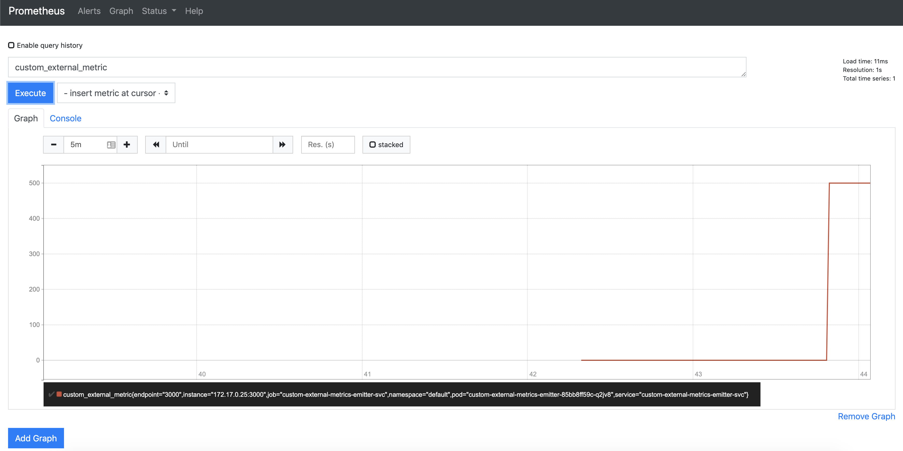

Parts:

* [Part 1 - introduction](https://blog.codekopp.com/kubernetes-custom-metrics-pt1/)
* [Part 2 - prometheus configuration](https://blog.codekopp.com/kubernetes-custom-metrics-pt2/)
* Part 3 - (sort of) external metrics (this post)

In the previous articles, we set up a minikube cluster which scaled
our app based on our custom metric. This showed how to use a
custom metric to scale pods. In this article, we'll walk through
how to set up an app to scale based off **some other** metric that isn't
necessarily related to the pods you're scaling.

The use case I'll outline is the following. Suppose you have a message
queue that has items that should be processed. The number of messages
that get put on the queue increases and decreases throughout the day,
and you'd like to scale your queue workers to respond to the message
queue size. In this case, you want to scale the pods based on
**the average number of messages per worker**, rather than just the
message queue size.

So what we want is a metric that represents our queue size, and then
we want to scale our pods based on the queue size, divided by the
number of workers running.

Due to a bug, we will have to represent this metric
as an `external` custom metric, as opposed to just a custom `object`
metric. The bug prevents us from scaling with an *average value* target
for `object` metrics. Not to worry. Everything is fine, I just might have
preferred to not use the `external` metric type.

Ok, let's hop in.

## Metric Emitter

Let's make an app that will expose our custom metric. This app will
*watch our message queue* and report the size of the queue to prometheus.
For demo purposes, this app doesn't actually go out and query the
message queue API to get the message queue size. Instead, it exposes
a REST API which allows the *message queue size* to be set.

`gist:c13f1b3a81f1b4020ed68438c89552cc#index.js`

Let's make two manifest files: one for the deployment, and one for the service.

```bash
kubectl apply -f examples/custom-external-emitter/manifests/deployment.yaml
kubectl apply -f examples/custom-external-emitter/manifests/service.yaml
```

Then once the app is up and running, grab its URL from minikube,
`minikube service custom-external-metrics-emitter-svc --url`, and
then hit it with:

```bash
curl <URL>/
curl <URL>/metrics
curl <URL>/value
curl -X PUT --header "Content-Type: application/json" \
     --data '{"value": 500}' \
     <URL>/value
```

In our previous articles, we set up prometheus to scrape node apps using
a custom ServiceMonitor resource definition. Check in prometheus to see
if our metric `custom_external_metric` shows up.



## Worker that Scales

We'll make a minimal node app which represents our queue worker. Since
it's not relevant to this article how exactly your message queue app
looks, my app basically logs some stuff and then sits around.

`gist:c13f1b3a81f1b4020ed68438c89552cc#worker-fake.js`

We'll make a couple manifest files. The deployment and service manifests
are straightforward. Let's take a look at the manifest for the
horizontal pod autoscaler.

`gist:c13f1b3a81f1b4020ed68438c89552cc#worker-hpa.yaml`

Here, we are specifying that our worker deployment should scale based off an
**external** metric, and that we will have an *average target value*, which means
that the metric will be divided by the number of replicas in our deployment,
and then compared to this target average value.

```bash
kubectl apply -f examples/custom-metric-scaled-worker/manifests/deployment.yaml
kubectl apply -f examples/custom-metric-scaled-worker/manifests/service.yaml
kubectl apply -f examples/custom-metric-scaled-worker/manifests/horizontal-pod-autoscaler.yaml
```

## Configuring prometheus-adapter

We didn't configure prometheus-adapter last time to use external metrics.
prometheus-adapter is capable of serving the `/apis/external.metrics.k8s.io`
api, but it needs to be enabled.

```bash
helm delete --purge prom-adpt
helm install -n prom-adpt --namespace monitoring \
    -f examples/custom-external-emitter/manifests/prom-adpt-values.yaml \
    stable/prometheus-adapter
```

`gist:c13f1b3a81f1b4020ed68438c89552cc#prom-adpt-values.yaml`

In a few minutes you should be able to validate the
`/apis/external.metrics.k8s.io` endpoint using
`kubectl get --raw /apis/external.metrics.k8s.io/v1beta1` and
see that the custom_external_metric item is being piped through.

```json
{
  "kind": "APIResourceList",
  "apiVersion": "v1",
  "groupVersion": "external.metrics.k8s.io/v1beta1",
  "resources": [{
    "name": "custom_external_metric",
    "singularName": "",
    "namespaced": true,
    "kind": "ExternalMetricValueList",
    "verbs": ["get"]
  }]
}
```

Sweet! Things are piping through like they should. A quick check
to `kubectl get hpa` confirms that our horizontal pod autoscaler
is finding the external metric and calculating the average!

## Conclusion

In this article, we walked through how to set up autoscaling of
a deployment based on some arbitrary,
external metric, averaged over the number of pods available.

Hopefully across the past several articles, you are able to find
some examples that help you accomplish your custom autoscaling
needs! Thanks for reading! Please reach out to me on the kubernetes
slack! I'd love to hear if you have questions or if this helped!
