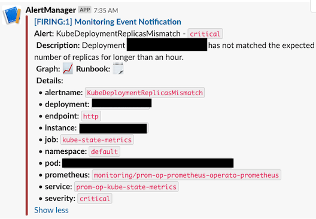

## Prometheus-Operator Intro

Prometheus-Operator is a great tool out of CoreOS. It makes it easy to deploy
`prometheus`, `grafana`, and `alert-manager` onto your cluster, the trusted trio of
kubernetes monitoring. Check out
[their website](https://github.com/coreos/prometheus-operator),
[their documentation](https://github.com/coreos/prometheus-operator/tree/master/Documentation),
and especially their docs on their
[Custom-Resource Definitions](https://github.com/coreos/prometheus-operator/blob/master/Documentation/design.md).
You need to understand how Prometheus
is deployed and how it knows which targets to scrape.

The easiest way to install `prometheus-operator` is via
[helm](https://github.com/helm/charts/tree/master/stable/prometheus-operator).
`helm install --name prom-op --namespace monitoring stable/prometheus-operator`.

In a thread on the k8s slack, I mentioned a couple ways I deviate from the defaults.
I'll outline those differences here in this post.

### Custom Values

Below is a gist outlining how I've deployed prometheus-operator.

`gist:0ff8457d5100dc6b1db4cf478659a037#values.yaml`

### A Few Words about EKS

EKS is a managed kuberenetes offering from AWS. Since it's managed,
you don't have to worry about monitoring some things. I have read some GitHub
Issues which claim to get monitoring of these sysetms set up, but haven't gotten
anything to work. Instead, I've turned off a handful of Prometheus alerting rules.
Without these lines, your AlertManager will always be firing these alerts.

I've also disabled the `defaultRules.rules.general` rule, and opted to modify
the general rule to not fire on kube-proxy, which it does by default. You
**really** want to make sure you add this rule, since this has the `Watchdog`
alert, also known as the dead man's switch.

`gist:0ff8457d5100dc6b1db4cf478659a037#general-rule.yaml`

### Ingress

One thing that `prometheus-operator` doesn't give you out of the box is ingress
to the various services. It has a really good reason to not do that by default.
**THESE SERVICES SHOULDN'T BE PUBLIC**. If they enabled ingress by default,
loads of folks' monitoring services would be naked and exposed to the world.
Very bad.

The ingress sections of the `values.yaml` need to have a few caveats. The cluster
these services are running on **has TWO nginx ingress controllers**. One is
public, and one is **private**. That is, the public nginx ingress controller
receives traffic from load balancers in public subnets, but the private
nginx controller receives traffic from load balancers that are not publically
addressable. They are locked down to only accept internal traffic. If folks
need to access these services, they need to get in via the VPN. If you want
to have a similar setup to this, then you'll need to know how to resolve your
private IPs through your VPN, have any necessary Route Table routes, etc etc.

You can further lock down your system by integrating OAuth systems with your
ingress controller if it allows it.

Let's take a look at the first part of the `prometheus` ingress.
It's the same for `grafana` and `alert-manager`.

```yaml
prometheus:
  ingress:
    enabled: enabled
    annotations:
      kubernetes.io/ingress.class: nginx-internal
      certmanager.k8s.io/cluster-issuer: letsencrypt-production
```

Obviously, the enabled flag tells the helm chart to create ingress resources
for `prometheus`. The annotations section is where you make sure that your
`prometheus` instance will remain private. Use the class name of the ingress
controller you want to go through to get to your services. Again, make sure
these are locked down via networking and security groups to only accept
internal traffic!

The next line line is relevant for the `cert-manager` setup. Basically, there
is a pod running from `cert-manager` that will pay attention to ingresses with
this annotation, and go try to acquire TLS certificates from Let's Encrypt's
production system (as opposed to Let's Encrypt staging system which is great
for testing).

Next, you need the actual ingress rules. To know exactly what I had to put
in these sections, I basically had to go reverse engineer from the actual
helm template. Here you go.

```yaml
hosts:
  - prometheus.<YOURDOMAIN>.com
paths:
  - "/"
tls:
  - hosts:
    - prometheus.<YOURDOMAIN>.com
    secretName: prom-op-prometheus-prod-cert
```

`hosts` and `paths` get sent to nginx's config so it knows what to do with
requests and how to route them to prometheus. The `tls` section is telling
nginx where to fetch the TLS certificate to serve. `cert-manager`, after
it completes its challenge (e.g. via DNS01), it'll save a Let's Encrypt
certificate as a k8s secret with that name.

### A Note about Thanos

There are two sections in the `values.yaml` file that are related to `thanos`.
Basically, `prometheus` is an ephemeral system. It stores data in memory
(makes it lightning fast), and then writes data in 2-hour blocks to
the file system in super-optimized read formats. But `prometheus` only
retains those files for 2 weeks! Oh no! You want that data stored longer?
Use `thanos`!

There are good instructions for setting up `thanos`:

* [here](https://github.com/coreos/prometheus-operator/blob/master/Documentation/thanos.md)
* [here](https://medium.com/@kakashiliu/deploy-prometheus-operator-with-thanos-60210eff172b)
* [here](https://itnext.io/monitoring-kubernetes-workloads-with-prometheus-and-thanos-4ddb394b32c)
* and [here](https://github.com/banzaicloud/banzai-charts/tree/master/thanos) (I used this helm chart)

As far as `prometheus-operator` goes, you just need two snippets of code.
The first is to give your `prometheus` pod the right permissions. Thanos
is going to back up your 2-hour blocks to S3, so it needs permission to do
that. Hopefully you're using
[kube2iam](https://github.com/helm/charts/tree/master/stable/kube2iam),
or something else to give your
pods the permissions they need, so that's what the block below is about.
Thanos is running as a sidecar container in the Prometheus pod, so this
goes in the prometheusSpec section of the `values.yaml`.

```yaml
prometheusSpec:
  annotations:
    iam.amazonaws.com/role: <ARN OF THANOS ROLE>
```

The next section is what is used to pass the `thanos` container what it
needs at runtime. Basically it's just telling `prometheus-operator` what
to use for versioning, and then for configuration.

```yaml
thanos:
  baseImage: quay.io/thanos/thanos
  version: v0.2.1
  objectStorageConfig:
    key: thanos.yaml
    name: thanos-objstore-config
```

### Node Affinity

I'd recommend having two sets of EC2 instance fleets. One that is more
stable, and one that is more for general workloads - more ephemeral stuff.
This lets you do cool things like have your general, autoscaling, production-serving
applications run on **spot** instances, without worrying that more critical
systems like nginx don't get terminated due to a spot instance being recalled
by AWS. See
[here](https://itnext.io/the-definitive-guide-to-running-ec2-spot-instances-as-kubernetes-worker-nodes-68ef2095e767)
to know everything about spot instances.

I've got node affinity on all these pods to run on my non-spot fleet. Paying
full price here on these instances, or using Reserve Instances to get steep discounts.
Regardless, I don't want the pods on these nodes to get disrupted, so I've got
them quarentined to my stable fleet. Regular workloads get shoved onto the spot
fleet.

```yaml
affinity:
  nodeAffinity:
    requiredDuringSchedulingIgnoredDuringExecution:
      nodeSelectorTerms:
      - matchExpressions:
        - key: duty
          operator: In
          values:
          - stable
```

### Alert-Manager Configuration

Out of the box, `alert-manager` won't send you Slack or PagerDuty alerts. It
doesn't know your endpoints or credentials! So you need to specify something
like lines 74-101 of the gist above to get `alert-manager` configured.
The `alertmanager.config` section
tells `alert-manager` to send me sweet messages for alerts via slack with
links to runbooks and prometheus charts. Check out
[this](https://prometheus.io/docs/alerting/configuration/)
for more information about configuring alert-manager.



## Wrapping Up

There's much more to be said about `prometheus-operator`, but these are a few
of the considerations and decisions I've made about how I want to run these applications
in my system.

Happy monitoring!
